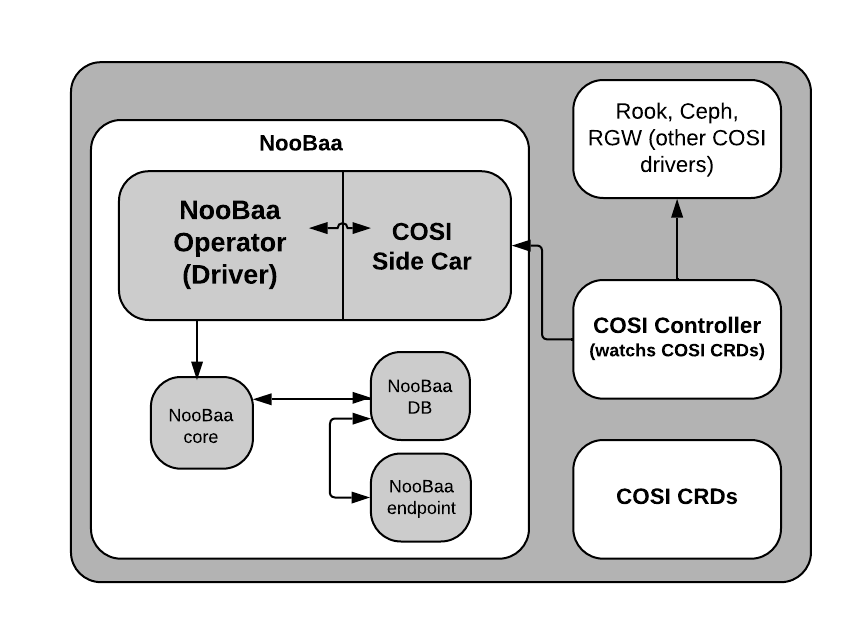

[NooBaa Operator](../README.md) /

# COSI buckets provisioner

Kubernetes natively supports dynamic provisioning for many types of file and block storage, but lacks support for object bucket provisioning.
In order to provide a native provisioning of object storage buckets, the concept of COSI Buckets was introduced in a similar manner to Persistent Volume Claim (PVC/PV)

The [container object storage interface api](https://github.com/kubernetes-sigs/container-object-storage-interface-api) provides a library implementation and design to unify the implementations of provisioning object storage buckets.

According to [COSI website](https://container-object-storage-interface.github.io/docs/deployment-guide) and [COSI Object Storage Design Document](https://github.com/kubernetes/enhancements/blob/master/keps/sig-storage/1979-object-storage-support/README.md)
the following components need to be deployed in Kubernetes on order to setup COSI:

1. [Custom Resource Definitions (CRDs)](#cosi-custom-resources) - will be deployed by ODF / the user
2. [Controller](#cosi-controller) - will be deployed by ODF / the user
3. [Sidecar for the driver](#cosi-side-car) - will be deployed as a sidecar container in NooBaa operator deployment
4. [Driver](#cosi-driver) - implemented inside noobaa's operator code

&nbsp;

## Architecture Diagram



For more details - [COSI architecture](https://github.com/kubernetes/enhancements/blob/master/keps/sig-storage/1979-object-storage-support/README.md#cosi-architecture)

&nbsp;

## COSI Controller

As decribed in [COSI website](https://container-object-storage-interface.github.io/docs/write-driver/cosi-controller) Container Object Storage (COSI) controller is responsible to manage lifecycle of COSI objects. Specifically, the controller monitors the lifecycle of the user-facing CRDs:

- BucketClaim: Represents a claim to provision a Bucket

- BucketAccess: Represents a resource to access a Bucket

and generates the associated CRDs:

- Bucket: Represents a Bucket or its equivalent in the storage backend

&nbsp;

## COSI Side Car and Driver

As [COSI architecture](https://github.com/kubernetes/enhancements/blob/master/keps/sig-storage/1979-object-storage-support/README.md#cosi-architecture) mentioned -

### COSI Side Car

The COSI Sidecar is the point of integration between COSI and drivers. All operations that require communication with the OSP is triggered by the Sidecar using gRPC calls to the driver. One active instance of Sidecar should be present for each driver.

&nbsp;

### COSI Driver

A component that runs alongside COSI Sidecar and satisfies the COSI gRPC API specification. Sidecar and driver work together to orchestrate changes in the OSP. The driver acts as a gRPC server to the COSI Sidecar. Each COSI driver is identified by a unique id.

&nbsp;

## Instructions for CRDs and controller deployments:

### Install COSI CRDs

```bash
kubectl create -k github.com/kubernetes-sigs/container-object-storage-interface-api
```

### Install COSI controller

```bash
kubectl create -k github.com/kubernetes-sigs/container-object-storage-interface-controller
```

&nbsp;

# COSI Custom Resources

COSI defined the following custom resource definitions:

- Bucket - the COSI equivalent of ob
- BucketClaim - the COSI equivalent of obc
- BucketClass - the COSI equivalent of bucketclass -(bucketclasses.noobaa.io)
- BucketAccess - account claim that will grant access to a specific bucket
- BucketAccessClass - a set of common properties shared by multiple accounts

&nbsp;

## COSI BucketClass

The operator creates a default bucket class with the name pattern `noobaa-default-bucket-class` (based on bucketclasses.noobaa.io CRD), this bucketclass provides a default template for OBC buckets.

However the administrator of a noobaa deployment can create additional COSI BucketClasses (based on bucketclasses.objectstorage.k8s.io CRD) that refer a placement policies or namespace policy, replication policy etc.

&nbsp;
Example of placement bucketclass:

```yaml
apiVersion: objectstorage.k8s.io/v1alpha1
kind: BucketClass
metadata:
  name: my-cosi-bucket-class
driverName: noobaa.objectstorage.k8s.io
DeletionPolicy: delete
parameters:
  placementPolicy: '{"tiers":[{"backingStores":["noobaa-default-backing-store"]}]}'
```

The equivalent noobaa cli command - 
noobaa cosi bucketclass create placement-bucketclass my-cosi-bucket-class --backingstores noobaa-default-backing-store


&nbsp;
Example of namespace bucketclass:

```yaml
apiVersion: objectstorage.k8s.io/v1alpha1
kind: BucketClass
metadata:
  name: my-cosi-ns-bucket-class
driverName: noobaa.objectstorage.k8s.io
DeletionPolicy: delete
parameters:
  namespacePolicy: '{"type": "Single", "single": { "resource": "nsr-name"}}'
```

The equivalent noobaa cli command - 
noobaa cosi bucketclass create namespace-bucketclass single my-cosi-ns-bucket-class --resource nsr-name

&nbsp;
Example of namespace bucketclass with a replication policy:

```yaml
apiVersion: objectstorage.k8s.io/v1alpha1
kind: BucketClass
metadata:
  name: my-cosi-ns-bucket-class
driverName: noobaa.objectstorage.k8s.io
DeletionPolicy: delete
parameters:
  placementPolicy: '{"tiers":[{"backingStores":["noobaa-default-backing-store"]}]}'
  replicationPolicy: '"{\"rules\":[{\"rule_id\":\"rule-1\",\"destination_bucket\":\"first.bucket\",\"filter\":{\"prefix\":\"a\"}}]}"'
```

The equivalent noobaa cli command - 
/path/to/json-file.json is the path to a JSON file which defines the replication policy
```shell
noobaa cosi bucketclass create placement-bucketclass my-cosi-ns-bucket-class --backingstores noobaa-default-backing-store
--replication-policy=/path/to/json-file.json

## COSI Bucket Claim

Applications that require a bucket will create a COSI bucket claim which must refer to a COSI bucket class (bucketClassName property).

The COSI controller will watch for COSI bucket claims and fulfill the claims by calling the side car, the side car will pass the request to the driver using a unix socket. Eventually the COSI provisioner will create/find existing bucket in NooBaa, and
create a COSI bucket.

When the COSI bucket claim was provisioned successfully, the status of the bucket claim and bucket CRs will be updated, a `Bucket Ready` property will be set to `true`.

Example of a bucket claim:

```yaml
apiVersion: objectstorage.k8s.io/v1alpha1
kind: BucketClaim
metadata:
  name: my-cosi-bucket-claim
spec:
  bucketClassName: my-cosi-bucket-class
  protocols:
    - "S3"
```

The equivalent noobaa cli command - 
noobaa cosi bucketclaim create my-cosi-bucket-claim --bucketclass my-cosi-bucket-class

## COSI BucketAccessClass

An administrator of a noobaa deployment can create BucketAccessClasses that contain common properties for different bucket access claims. Currently, the only authenticationType supported by noobaa driver is KEY.

Example of a bucket access class:

```yaml
apiVersion: objectstorage.k8s.io/v1alpha1
kind: BucketAccessClass
metadata:
  name: my-cosi-bucket-access-class
driverName: noobaa.objectstorage.k8s.io
authenticationType: KEY
```

# COSI BucketAccess claim

An administrator of a noobaa deployment can create BucketAccess claim that refers to a BucketAccessClass in order to get credentials that will provide access to a COSI bucket claim. NooBaa will generate an account and will return credentials as the bucket access claim response, then a Secret (named by credentialsSecretName property) containing the bucket info will be created. The properties bucketClaimName, bucketAccessClassName and credentialsSecretName are all required values.

When the COSI bucketAccess claim was granted successfully, the status of the bucketAccess claim CR will be updated, a `Access Granted` property will be set to `true`.

Example of bucket access claim:

```yaml
apiVersion: objectstorage.k8s.io/v1alpha1
kind: BucketAccess
metadata:
  name: my-cosi-bucket-access
spec:
  bucketClaimName: my-cosi-bucket-claim
  bucketAccessClassName: my-cosi-bucket-access-class
  credentialsSecretName: my-cosi-bucket-creds
```

# Using the COSI bucket claim

Once the COSI bucket claim is provisioned by the operator, a bucket will be created in NooBaa, a Secret bucket info will be created. For the example above, the Secret will be named `my-cosi-bucket-creds`.

The content of the Secret provides all the information needed by the application in order to connect to the bucket using S3 API, and these can be mounted into the application pods using env or volumes. The application should configure its S3 SDK to use the AWS_ACCESS_KEY_ID & AWS_SECRET_ACCESS_KEY credentials as provided by the Secret, and the endpoint and BUCKET_NAME - see below.

# Embedding COSI bucket claim in the Application

An application deployment can claim a bucket and a bucket access and refer to the expected Secret in a static deployment yaml, since the names of the Secret provided by the user, and pods that mount information from Secret will not start until those resources exist, this provides a self contained deployment that will only run the application once the bucket provisioning is complete.
Whenever a client application running in the cluster wants to use it and trust the cluster CA it should use the service name instead, which is `s3.<noobaa-namespace>.svc.cluster.local` with the default 443 https port.

Here is an example yaml that combines the cosi bucket claim and a Pod that uses it:

```yaml
apiVersion: objectstorage.k8s.io/v1alpha1
kind: BucketClass
metadata:
  name: my-cosi-bucket-class
driverName: noobaa.objectstorage.k8s.io
DeletionPolicy: delete
parameters:
  placementPolicy: '{"tiers":[{"backingStores":["noobaa-default-backing-store"]}]}'
---
apiVersion: objectstorage.k8s.io/v1alpha1
kind: BucketClaim
metadata:
  name: my-cosi-bucket-claim
spec:
  bucketClassName: my-cosi-bucket-class
  protocols:
    - "S3"
---
apiVersion: objectstorage.k8s.io/v1alpha1
kind: BucketAccessClass
metadata:
  name: my-cosi-bucket-access-class
driverName: noobaa.objectstorage.k8s.io
authenticationType: KEY
---
apiVersion: objectstorage.k8s.io/v1alpha1
kind: BucketAccess
metadata:
  name: my-cosi-bucket-access
spec:
  bucketClaimName: my-cosi-bucket-claim
  bucketAccessClassName: my-cosi-bucket-access-class
  credentialsSecretName: my-cosi-bucket-creds
---
apiVersion: v1
kind: Pod
metadata:
  name: my-pod
  labels:
    app: my-app
spec:
  containers:
    - name: app
      envFrom:
        - secretRef:
            name: my-cosi-bucket-creds
      image: banst/awscli
      command:
        - sh
        - "-c"
        - |
          echo "----> Configuring S3 endpoint ...";
          pip install awscli-plugin-endpoint;
          aws configure set plugins.endpoint awscli_plugin_endpoint;
          aws configure set s3.endpoint_url https://s3.noobaa.svc.cluster.local;
          echo "----> Configuring S3 credentials ...";
          export AWS_ACCESS_KEY_ID=$(jq -n -r $BucketInfo.spec.secretS3.accessKeyID)
          export AWS_SECRET_ACCESS_KEY=$(jq -n -r $BucketInfo.spec.secretS3.accessSecretKey)
          export BUCKET_NAME=$(jq -n -r $BucketInfo.spec.bucketName)
          echo "----> Configuring certificates ...";
          aws configure set ca_bundle /var/run/secrets/kubernetes.io/serviceaccount/service-ca.crt;
          echo "----> Copying files ...";
          aws s3 cp --recursive /etc s3://$BUCKET_NAME;
          echo "----> List files ...";
          aws s3 ls $BUCKET_NAME;
          echo "----> Done.";
```

# Bucket Permissions and Sharing

The scope of bucket permissions is at the claim scope - this means that the credentials of the bucket claim are confined to access only that single COSI bucket. Notice that also listing buckets with these S3 credentials will return only that one bucket.
