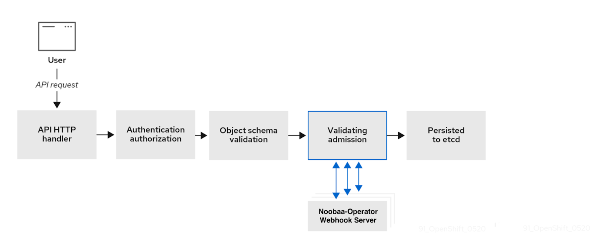

[NooBaa Operator](../README.md) /
# Noobaa Admission Controller

Noobaa admission server utilize k8s admission webhook feature to validate various Noobaa custom resource definitions. using [admission-webhook.yaml](../deploy/internal/admission-webhook.yaml) we define which resources we want to be validated by the admission server and also on which operations. this configuration will specify to the api-server which request to forward to the admission server. the admission server is implemented as a sub-routine inside noobaa-operator pod.

# Definitions

- ValidatingWebhookConfiguration: [admission-webhook.yaml](../deploy/internal/admission-webhook.yaml)
# Admission server

## Architecture Diagram



#
## Installation 
```bash
noobaa install --admission
```

## Validation Process
Any request that falls under the rules described in the [admission-webhook.yaml](../deploy/internal/admission-webhook.yaml) is being forwarded to the admission server (assuming it is being deployed), then the admission server will validate the resource, if the validation fails, the user will get an error, explaining why the validation failed, without the system knowing there was any request.

For example, let's try to apply this yaml file with an invalid Backingstore spec, notice we're not providing a secret name
```yaml
apiVersion: noobaa.io/v1alpha1
kind: BackingStore
metadata:
  labels:
    app: noobaa
  name: backingstore-name
  namespace: default
spec:
  awsS3:
    secret:
      name:
      namespace: default
    targetBucket: target-bucket
  type: aws-s3
```
when we'll apply the yaml to the cluster, we'll get this error message
```bash
kubectl apply -f bs-test.yaml

Error from server: error when creating "bs-test.yaml": admission webhook "admissionwebhook.noobaa.io" denied the request: Failed creating the Backingstore, please provide a valid ARN or secret name
```

## Disabling Feature
There is an environment variable inside `noobaa-operator` that indicates to the server to be enabled or disabled.
The environment variable name is `ENABLE_NOOBAA_ADMISSION`, by setting this env var to `false` in the operator deployment and restarting the pod the feature will be disabled.
```bash
kubectl set env deployment/noobaa-operator ENABLE_NOOBAA_ADMISSION=false
```

# Tests

## Unit tests

The admission unit tests are written using Ginkgo framework, the test cases are divided based on the resource types, each validation function is tested twice, first on a resource that should fail the validation and then on a resource that should pass the validation. 

In order to run the tests
```bash
ginkgo -v pkg/admission/test/unit
```
or
```bash
make test-go
```
and it will run all the test files of the project.

#

## Integration tests
The admission integration tests are written using Ginkgo framework and should be run only inside an integration environment as part of a Pull Request. to run the integration tests locally, a Noobaa system should be deployed in `test` namespace with the admission feature turned on. 

For example:
```bash
noobaa install -n test --mini --admission 
```
Comment out this part from [admission_suite_integ_test.go](../pkg/admission/test/integ/admission_suite_integ_test.go)
```go
func TestAdmission(t *testing.T) {
	// this variable is defined in .github/workflows/run_admission_test.yml
	// indication of running in integration test environment
	// _, ok := os.LookupEnv("OPERATOR_IMAGE")
	// if !ok {
	// 	t.Skip() // Not an integration test, skip
	// }
	RegisterFailHandler(Fail)
	RunSpecs(t, "Admission Suite")
}
```
and then run 
```bash
make test-admission
```
***NOTE***

When the tests are done, make sure to delete the resources that didn't get deleted, as well as the `test.bucket` bucket.
pay attention the test flow is very dependent on one another, meaning one test fail can cause a failure in all of the tests. 

